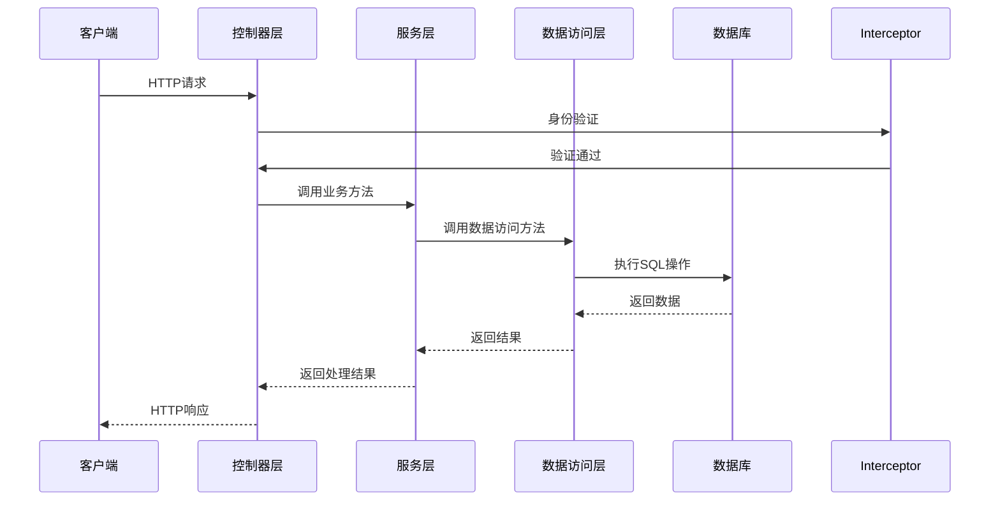
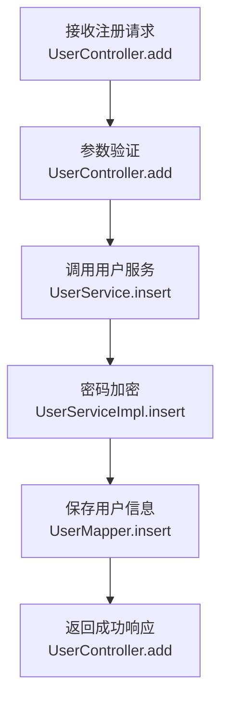
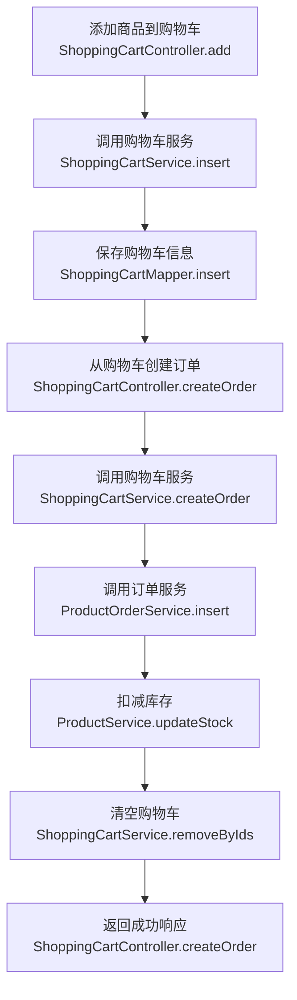
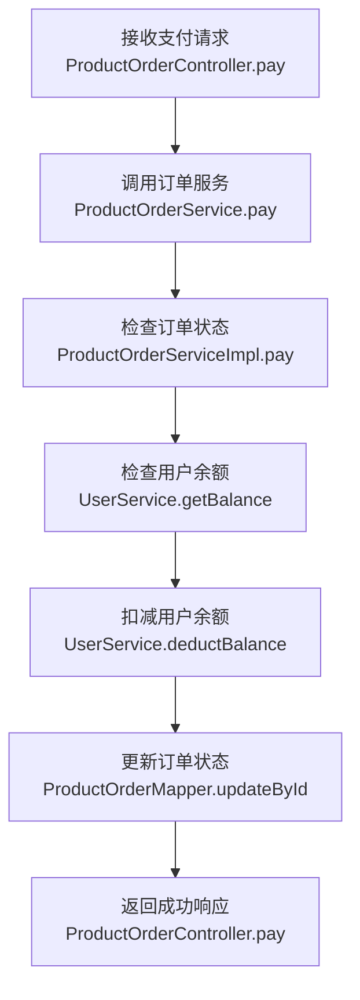

# 系统设计报告

## 1. 仓库分析

通过对仓库的分析，我们可以看到这是一个基于 Spring Boot 3.2.10 开发的电商系统，采用了典型的三层架构设计。系统包含了用户管理、商品管理、订单管理、购物车管理、店铺管理等核心功能模块。

### 1.1 技术栈分析

| 技术/框架 | 版本 | 用途 | 来源 |
|---------|------|-----|-----|
| Spring Boot | 3.2.10 | 应用框架 | pom.xml:8 |
| MyBatis | 3.0.4 | ORM 框架 | pom.xml:46 |
| MySQL | 8.0.31 | 数据库 | pom.xml:30 |
| JWT | 0.9.1 | 身份认证 | pom.xml:60 |
| Hutool | 5.7.20 | 工具库 | pom.xml:67 |
| Fastjson | 2.0.53 | JSON 处理 | pom.xml:53 |
| Spring AOP | - | 面向切面编程 | pom.xml:89 |

### 1.2 目录结构分析

项目采用了典型的 Maven 项目结构，主要目录包括：

- **src/main/java/com/project/platform/**: 主源码目录
  - **controller/**: 控制器层，处理 HTTP 请求
  - **service/**: 服务层，实现业务逻辑
  - **mapper/**: 数据访问层，处理数据库操作
  - **entity/**: 实体类，对应数据库表结构
  - **dto/**: 数据传输对象
  - **vo/**: 视图对象
  - **utils/**: 工具类
  - **config/**: 配置类
  - **interceptor/**: 拦截器
  - **exception/**: 异常处理

- **src/main/resources/**: 资源文件目录
  - **mapper/**: MyBatis XML 映射文件
  - **application.yaml**: 应用配置文件

- **sql/**: SQL 脚本目录

### 1.3 核心功能模块

| 模块 | 主要功能 | 控制器 | 服务 | 实体 |
|-----|---------|-------|------|------|
| 用户管理 | 用户注册、登录、充值等 | UserController | UserService | User |
| 商品管理 | 商品CRUD、推荐、销量排行 | ProductController | ProductService | Product |
| 订单管理 | 订单CRUD、支付、取消、发货、确认收货 | ProductOrderController | ProductOrderService | ProductOrder |
| 购物车管理 | 购物车CRUD、创建订单 | ShoppingCartController | ShoppingCartService | ShoppingCart |
| 店铺管理 | 店铺CRUD、收藏 | ShopController | ShopService | Shop |
| 商品分类 | 商品分类CRUD | ProductTypeController | ProductTypeService | ProductType |
| 地址管理 | 收货地址CRUD | ShippingAddressController | ShippingAddressService | ShippingAddress |
| 广告管理 | 广告CRUD | AdvertisingController | AdvertisingService | Advertising |
| 轮播图管理 | 轮播图CRUD | SlideshowController | SlideshowService | Slideshow |
| 统计报表 | 数据统计 | StatisticalReportFormsController | StatisticalReportFormsService | - |

## 2. 系统设计

### 2.1. 架构设计

- **架构风格**: 集成式单体应用 (Integrated Monolith)。
- **模块划分**:
  - 控制层 (Controller): 处理 HTTP 请求，参数验证，返回响应
  - 服务层 (Service): 实现业务逻辑，处理事务
  - 数据访问层 (Mapper): 处理数据库操作
  - 实体层 (Entity): 对应数据库表结构
  - 工具层 (Utils): 提供通用工具方法
  - 配置层 (Config): 系统配置
  - 拦截器 (Interceptor): 请求拦截，身份验证

- **核心流程图**:



### 2.2. 目录结构设计

```plaintext
src/main/java/com/project/platform/
├── config/             # 配置类
│   ├── CorsConfig.java         # 跨域配置
│   ├── LocalDateTimeConfig.java # 时间配置
│   └── SpringMvcConfig.java    # Spring MVC配置
├── controller/         # 控制器层
│   ├── UserController.java      # 用户控制器
│   ├── ProductController.java   # 商品控制器
│   ├── ProductOrderController.java # 订单控制器
│   └── ...                      # 其他控制器
├── dto/                # 数据传输对象
│   ├── LoginDTO.java            # 登录DTO
│   ├── UpdatePasswordDTO.java   # 修改密码DTO
│   └── ...                      # 其他DTO
├── entity/             # 实体类
│   ├── User.java                # 用户实体
│   ├── Product.java             # 商品实体
│   ├── ProductOrder.java        # 订单实体
│   └── ...                      # 其他实体
├── exception/          # 异常处理
│   ├── CustomException.java     # 自定义异常
│   └── GlobalExceptionHandler.java # 全局异常处理器
├── interceptor/        # 拦截器
│   └── LoginInterceptor.java    # 登录拦截器
├── mapper/             # 数据访问层
│   ├── UserMapper.java          # 用户Mapper
│   ├── ProductMapper.java       # 商品Mapper
│   └── ...                      # 其他Mapper
├── service/            # 服务层
│   ├── impl/                    # 服务实现
│   │   ├── UserServiceImpl.java # 用户服务实现
│   │   ├── ProductServiceImpl.java # 商品服务实现
│   │   └── ...                  # 其他服务实现
│   ├── UserService.java         # 用户服务接口
│   ├── ProductService.java      # 商品服务接口
│   └── ...                      # 其他服务接口
├── utils/              # 工具类
│   ├── JwtUtils.java            # JWT工具
│   ├── CurrentUserThreadLocal.java # 当前用户线程本地变量
│   └── TimeUtils.java           # 时间工具
├── vo/                 # 视图对象
│   ├── ResponseVO.java          # 响应VO
│   ├── PageVO.java              # 分页VO
│   └── ...                      # 其他VO
└── ProjectManagement.java # 应用主类
```

* 说明：
  * `config/`（新增）：存放系统配置类
  * `controller/`（新增）：存放控制器类，处理HTTP请求
  * `dto/`（新增）：存放数据传输对象，用于前后端数据交互
  * `entity/`（新增）：存放实体类，对应数据库表结构
  * `exception/`（新增）：存放异常处理相关类
  * `interceptor/`（新增）：存放拦截器，用于请求拦截和身份验证
  * `mapper/`（新增）：存放数据访问接口，处理数据库操作
  * `service/`（新增）：存放服务接口和实现，实现业务逻辑
  * `utils/`（新增）：存放工具类，提供通用功能
  * `vo/`（新增）：存放视图对象，用于返回前端的数据结构

### 2.3. 关键类与函数设计

| 类/函数名 | 说明 | 参数（类型/含义） | 成功返回结构/类型 | 失败返回结构/类型 | 所属文件/模块 | 溯源 |
|----------|------|-----------------|-----------------|-----------------|-------------|-----|
| `UserService.insert()` | 用户注册 | User entity: 用户实体 | 无 | 异常 | service/impl/UserServiceImpl.java | UserController.java:62-65 |
| `UserService.topUp()` | 用户充值 | Integer userId: 用户ID<br>Float amount: 充值金额 | 无 | 异常 | service/impl/UserServiceImpl.java | UserController.java:91-96 |
| `ProductService.page()` | 商品分页查询 | Map<String, Object> query: 查询条件<br>Integer pageNum: 页码<br>Integer pageSize: 每页大小 | PageVO<Product> | 异常 | service/impl/ProductServiceImpl.java | ProductController.java:37-42 |
| `ProductService.salesVolumeTop()` | 销量排行 | int size: 数量 | List<Product> | 异常 | service/impl/ProductServiceImpl.java | ProductController.java:110-113 |
| `ProductService.recommended()` | 推荐商品 | int size: 数量 | List<Product> | 异常 | service/impl/ProductServiceImpl.java | ProductController.java:120-123 |
| `ProductOrderService.pay()` | 订单支付 | Integer id: 订单ID | 无 | 异常 | service/impl/ProductOrderServiceImpl.java | ProductOrderController.java:103-107 |
| `ProductOrderService.cancel()` | 取消订单 | Integer id: 订单ID | 无 | 异常 | service/impl/ProductOrderServiceImpl.java | ProductOrderController.java:115-119 |
| `ProductOrderService.delivery()` | 订单发货 | Integer id: 订单ID<br>String trackingNumber: 物流单号 | 无 | 异常 | service/impl/ProductOrderServiceImpl.java | ProductOrderController.java:128-132 |
| `ProductOrderService.confirm()` | 确认收货 | Integer id: 订单ID | 无 | 异常 | service/impl/ProductOrderServiceImpl.java | ProductOrderController.java:139-143 |
| `ShoppingCartService.createOrder()` | 购物车创建订单 | CreateOrderByShoppingCartDTO dto: 创建订单DTO | 无 | 异常 | service/impl/ShoppingCartServiceImpl.java | ShoppingCartController.java:100-106 |
| `JwtUtils.generateToken()` | 生成JWT令牌 | String username: 用户名<br>String type: 用户类型 | String token | 异常 | utils/JwtUtils.java | - |
| `JwtUtils.parseToken()` | 解析JWT令牌 | String token: 令牌 | Claims | 异常 | utils/JwtUtils.java | - |

### 2.4. 数据库与数据结构设计

#### 2.4.1 数据库表结构

**`user`表**
| 字段名 | 数据类型 | 约束 | 描述 |
|-------|---------|------|------|
| `id` | `int` | `PRIMARY KEY AUTO_INCREMENT` | 用户ID |
| `username` | `varchar(255)` | `UNIQUE NOT NULL` | 用户名 |
| `password` | `varchar(255)` | `NOT NULL` | 密码 |
| `nickname` | `varchar(255)` | | 昵称 |
| `avatar` | `varchar(255)` | | 头像 |
| `balance` | `decimal(10,2)` | `DEFAULT 0` | 余额 |
| `type` | `varchar(255)` | `DEFAULT 'USER'` | 用户类型 |
| `create_time` | `datetime` | `DEFAULT CURRENT_TIMESTAMP` | 创建时间 |
| `update_time` | `datetime` | `DEFAULT CURRENT_TIMESTAMP ON UPDATE CURRENT_TIMESTAMP` | 更新时间 |

**`product`表**
| 字段名 | 数据类型 | 约束 | 描述 |
|-------|---------|------|------|
| `id` | `int` | `PRIMARY KEY AUTO_INCREMENT` | 商品ID |
| `name` | `varchar(255)` | `NOT NULL` | 商品名称 |
| `description` | `text` | | 商品描述 |
| `price` | `decimal(10,2)` | `NOT NULL` | 价格 |
| `stock` | `int` | `NOT NULL` | 库存 |
| `sales` | `int` | `DEFAULT 0` | 销量 |
| `product_type_id` | `int` | `REFERENCES product_type(id)` | 商品分类ID |
| `shop_id` | `int` | `REFERENCES shop(id)` | 店铺ID |
| `image` | `varchar(255)` | | 商品图片 |
| `create_time` | `datetime` | `DEFAULT CURRENT_TIMESTAMP` | 创建时间 |
| `update_time` | `datetime` | `DEFAULT CURRENT_TIMESTAMP ON UPDATE CURRENT_TIMESTAMP` | 更新时间 |

**`product_order`表**
| 字段名 | 数据类型 | 约束 | 描述 |
|-------|---------|------|------|
| `id` | `int` | `PRIMARY KEY AUTO_INCREMENT` | 订单ID |
| `order_no` | `varchar(255)` | `UNIQUE NOT NULL` | 订单号 |
| `user_id` | `int` | `REFERENCES user(id)` | 用户ID |
| `total_amount` | `decimal(10,2)` | `NOT NULL` | 总金额 |
| `status` | `varchar(255)` | `NOT NULL` | 订单状态 |
| `shipping_address_id` | `int` | `REFERENCES shipping_address(id)` | 收货地址ID |
| `tracking_number` | `varchar(255)` | | 物流单号 |
| `create_time` | `datetime` | `DEFAULT CURRENT_TIMESTAMP` | 创建时间 |
| `update_time` | `datetime` | `DEFAULT CURRENT_TIMESTAMP ON UPDATE CURRENT_TIMESTAMP` | 更新时间 |

**`shopping_cart`表**
| 字段名 | 数据类型 | 约束 | 描述 |
|-------|---------|------|------|
| `id` | `int` | `PRIMARY KEY AUTO_INCREMENT` | 购物车ID |
| `user_id` | `int` | `REFERENCES user(id)` | 用户ID |
| `product_id` | `int` | `REFERENCES product(id)` | 商品ID |
| `quantity` | `int` | `NOT NULL` | 数量 |
| `create_time` | `datetime` | `DEFAULT CURRENT_TIMESTAMP` | 创建时间 |
| `update_time` | `datetime` | `DEFAULT CURRENT_TIMESTAMP ON UPDATE CURRENT_TIMESTAMP` | 更新时间 |

**`shop`表**
| 字段名 | 数据类型 | 约束 | 描述 |
|-------|---------|------|------|
| `id` | `int` | `PRIMARY KEY AUTO_INCREMENT` | 店铺ID |
| `name` | `varchar(255)` | `NOT NULL` | 店铺名称 |
| `description` | `text` | | 店铺描述 |
| `logo` | `varchar(255)` | | 店铺Logo |
| `create_time` | `datetime` | `DEFAULT CURRENT_TIMESTAMP` | 创建时间 |
| `update_time` | `datetime` | `DEFAULT CURRENT_TIMESTAMP ON UPDATE CURRENT_TIMESTAMP` | 更新时间 |

**`product_type`表**
| 字段名 | 数据类型 | 约束 | 描述 |
|-------|---------|------|------|
| `id` | `int` | `PRIMARY KEY AUTO_INCREMENT` | 分类ID |
| `name` | `varchar(255)` | `NOT NULL` | 分类名称 |
| `parent_id` | `int` | `REFERENCES product_type(id)` | 父分类ID |
| `create_time` | `datetime` | `DEFAULT CURRENT_TIMESTAMP` | 创建时间 |
| `update_time` | `datetime` | `DEFAULT CURRENT_TIMESTAMP ON UPDATE CURRENT_TIMESTAMP` | 更新时间 |

**`shipping_address`表**
| 字段名 | 数据类型 | 约束 | 描述 |
|-------|---------|------|------|
| `id` | `int` | `PRIMARY KEY AUTO_INCREMENT` | 地址ID |
| `user_id` | `int` | `REFERENCES user(id)` | 用户ID |
| `name` | `varchar(255)` | `NOT NULL` | 收货人姓名 |
| `phone` | `varchar(255)` | `NOT NULL` | 手机号 |
| `province` | `varchar(255)` | `NOT NULL` | 省份 |
| `city` | `varchar(255)` | `NOT NULL` | 城市 |
| `district` | `varchar(255)` | `NOT NULL` | 区县 |
| `detail_address` | `varchar(255)` | `NOT NULL` | 详细地址 |
| `is_default` | `int` | `DEFAULT 0` | 是否默认 |
| `create_time` | `datetime` | `DEFAULT CURRENT_TIMESTAMP` | 创建时间 |
| `update_time` | `datetime` | `DEFAULT CURRENT_TIMESTAMP ON UPDATE CURRENT_TIMESTAMP` | 更新时间 |

#### 2.4.2 数据传输对象 (DTOs)

**LoginDTO**
| 字段名 | 类型 | 描述 |
|-------|------|------|
| `username` | `String` | 用户名 |
| `password` | `String` | 密码 |

**UpdatePasswordDTO**
| 字段名 | 类型 | 描述 |
|-------|------|------|
| `oldPassword` | `String` | 旧密码 |
| `newPassword` | `String` | 新密码 |

**CreateOrderByShoppingCartDTO**
| 字段名 | 类型 | 描述 |
|-------|------|------|
| `shoppingCartIds` | `List<Integer>` | 购物车ID列表 |
| `shippingAddressId` | `Integer` | 收货地址ID |

#### 2.4.3 视图对象 (VOs)

**ResponseVO**
| 字段名 | 类型 | 描述 |
|-------|------|------|
| `code` | `Integer` | 响应码 |
| `message` | `String` | 响应消息 |
| `data` | `T` | 响应数据 |

**PageVO**
| 字段名 | 类型 | 描述 |
|-------|------|------|
| `total` | `Long` | 总记录数 |
| `list` | `List<T>` | 数据列表 |
| `pageNum` | `Integer` | 当前页码 |
| `pageSize` | `Integer` | 每页大小 |

### 2.5. API 接口设计

#### 2.5.1 用户相关接口

| API路径 | 方法 | 模块/文件 | 类型 | 功能描述 | 请求体 (JSON) | 成功响应 (200 OK) |
|---------|------|-----------|------|---------|--------------|------------------|
| `/user/page` | `GET` | `UserController` | `Router` | 用户分页查询 | N/A | `{"code": 200, "message": "success", "data": {"total": 100, "list": [...], "pageNum": 1, "pageSize": 10}}` |
| `/user/list` | `GET` | `UserController` | `Router` | 获取用户列表 | N/A | `{"code": 200, "message": "success", "data": [...]}` |
| `/user/selectById/{id}` | `GET` | `UserController` | `Router` | 根据ID查询用户 | N/A | `{"code": 200, "message": "success", "data": {...}}` |
| `/user/selectByUsername/{username}` | `GET` | `UserController` | `Router` | 根据用户名查询用户 | N/A | `{"code": 200, "message": "success", "data": {...}}` |
| `/user/add` | `POST` | `UserController` | `Router` | 新增用户 | `{"username": "test", "password": "123456", "nickname": "测试用户"}` | `{"code": 200, "message": "success", "data": null}` |
| `/user/update` | `PUT` | `UserController` | `Router` | 更新用户 | `{"id": 1, "username": "test", "nickname": "测试用户"}` | `{"code": 200, "message": "success", "data": null}` |
| `/user/delBatch` | `DELETE` | `UserController` | `Router` | 批量删除用户 | `[1, 2, 3]` | `{"code": 200, "message": "success", "data": null}` |
| `/user/topUp/{amount}` | `POST` | `UserController` | `Router` | 用户充值 | N/A | `{"code": 200, "message": "success", "data": null}` |

#### 2.5.2 商品相关接口

| API路径 | 方法 | 模块/文件 | 类型 | 功能描述 | 请求体 (JSON) | 成功响应 (200 OK) |
|---------|------|-----------|------|---------|--------------|------------------|
| `/product/page` | `GET` | `ProductController` | `Router` | 商品分页查询 | N/A | `{"code": 200, "message": "success", "data": {"total": 100, "list": [...], "pageNum": 1, "pageSize": 10}}` |
| `/product/selectById/{id}` | `GET` | `ProductController` | `Router` | 根据ID查询商品 | N/A | `{"code": 200, "message": "success", "data": {...}}` |
| `/product/list` | `GET` | `ProductController` | `Router` | 获取商品列表 | N/A | `{"code": 200, "message": "success", "data": [...]}` |
| `/product/add` | `POST` | `ProductController` | `Router` | 新增商品 | `{"name": "商品名称", "price": 99.99, "stock": 100, "productTypeId": 1, "shopId": 1}` | `{"code": 200, "message": "success", "data": null}` |
| `/product/update` | `PUT` | `ProductController` | `Router` | 更新商品 | `{"id": 1, "name": "商品名称", "price": 99.99, "stock": 100}` | `{"code": 200, "message": "success", "data": null}` |
| `/product/delBatch` | `DELETE` | `ProductController` | `Router` | 批量删除商品 | `[1, 2, 3]` | `{"code": 200, "message": "success", "data": null}` |
| `/product/salesVolumeTop/{size}` | `GET` | `ProductController` | `Router` | 销量排行 | N/A | `{"code": 200, "message": "success", "data": [...]}` |
| `/product/recommend/{size}` | `GET` | `ProductController` | `Router` | 推荐商品 | N/A | `{"code": 200, "message": "success", "data": [...]}` |

#### 2.5.3 订单相关接口

| API路径 | 方法 | 模块/文件 | 类型 | 功能描述 | 请求体 (JSON) | 成功响应 (200 OK) |
|---------|------|-----------|------|---------|--------------|------------------|
| `/productOrder/page` | `GET` | `ProductOrderController` | `Router` | 订单分页查询 | N/A | `{"code": 200, "message": "success", "data": {"total": 100, "list": [...], "pageNum": 1, "pageSize": 10}}` |
| `/productOrder/selectById/{id}` | `GET` | `ProductOrderController` | `Router` | 根据ID查询订单 | N/A | `{"code": 200, "message": "success", "data": {...}}` |
| `/productOrder/list` | `GET` | `ProductOrderController` | `Router` | 获取订单列表 | N/A | `{"code": 200, "message": "success", "data": [...]}` |
| `/productOrder/add` | `POST` | `ProductOrderController` | `Router` | 新增订单 | `{"orderNo": "202401010001", "userId": 1, "totalAmount": 99.99, "status": "PENDING"}` | `{"code": 200, "message": "success", "data": null}` |
| `/productOrder/update` | `PUT` | `ProductOrderController` | `Router` | 更新订单 | `{"id": 1, "status": "PAID"}` | `{"code": 200, "message": "success", "data": null}` |
| `/productOrder/delBatch` | `DELETE` | `ProductOrderController` | `Router` | 批量删除订单 | `[1, 2, 3]` | `{"code": 200, "message": "success", "data": null}` |
| `/productOrder/pay/{id}` | `POST` | `ProductOrderController` | `Router` | 订单支付 | N/A | `{"code": 200, "message": "success", "data": null}` |
| `/productOrder/cancel/{id}` | `POST` | `ProductOrderController` | `Router` | 取消订单 | N/A | `{"code": 200, "message": "success", "data": null}` |
| `/productOrder/delivery/{id}` | `POST` | `ProductOrderController` | `Router` | 订单发货 | N/A | `{"code": 200, "message": "success", "data": null}` |
| `/productOrder/confirm/{id}` | `POST` | `ProductOrderController` | `Router` | 确认收货 | N/A | `{"code": 200, "message": "success", "data": null}` |

#### 2.5.4 购物车相关接口

| API路径 | 方法 | 模块/文件 | 类型 | 功能描述 | 请求体 (JSON) | 成功响应 (200 OK) |
|---------|------|-----------|------|---------|--------------|------------------|
| `/shoppingCart/page` | `GET` | `ShoppingCartController` | `Router` | 购物车分页查询 | N/A | `{"code": 200, "message": "success", "data": {"total": 100, "list": [...], "pageNum": 1, "pageSize": 10}}` |
| `/shoppingCart/selectById/{id}` | `GET` | `ShoppingCartController` | `Router` | 根据ID查询购物车 | N/A | `{"code": 200, "message": "success", "data": {...}}` |
| `/shoppingCart/list` | `GET` | `ShoppingCartController` | `Router` | 获取购物车列表 | N/A | `{"code": 200, "message": "success", "data": [...]}` |
| `/shoppingCart/add` | `POST` | `ShoppingCartController` | `Router` | 新增购物车 | `{"userId": 1, "productId": 1, "quantity": 1}` | `{"code": 200, "message": "success", "data": null}` |
| `/shoppingCart/update` | `PUT` | `ShoppingCartController` | `Router` | 更新购物车 | `{"id": 1, "quantity": 2}` | `{"code": 200, "message": "success", "data": null}` |
| `/shoppingCart/delBatch` | `DELETE` | `ShoppingCartController` | `Router` | 批量删除购物车 | `[1, 2, 3]` | `{"code": 200, "message": "success", "data": null}` |
| `/shoppingCart/createOrder` | `POST` | `ShoppingCartController` | `Router` | 购物车创建订单 | `{"shoppingCartIds": [1, 2], "shippingAddressId": 1}` | `{"code": 200, "message": "success", "data": null}` |

### 2.6. 主业务流程与调用链

#### 2.6.1 用户注册流程



调用链：
* `UserController.add()` → `UserService.insert()` → `UserServiceImpl.insert()` → `UserMapper.insert()`

#### 2.6.2 商品购买流程



调用链：
* `ShoppingCartController.add()` → `ShoppingCartService.insert()` → `ShoppingCartMapper.insert()`
* `ShoppingCartController.createOrder()` → `ShoppingCartService.createOrder()` → `ProductOrderService.insert()` → `ProductService.updateStock()` → `ShoppingCartService.removeByIds()`

#### 2.6.3 订单支付流程



调用链：
* `ProductOrderController.pay()` → `ProductOrderService.pay()` → `UserService.getBalance()` → `UserService.deductBalance()` → `ProductOrderMapper.updateById()`

## 3. 部署与集成方案

### 3.1. 依赖与环境

| 依赖 | 版本/范围 | 用途 | 安装命令 | 所属文件/配置 |
|------|-----------|------|---------|--------------|
| `spring-boot-starter-web` | 3.2.10 | Web 应用支持 | 已在 pom.xml 中配置 | pom.xml:24 |
| `mysql-connector-j` | 8.0.31 | MySQL 驱动 | 已在 pom.xml 中配置 | pom.xml:29 |
| `mybatis-spring-boot-starter` | 3.0.4 | MyBatis 集成 | 已在 pom.xml 中配置 | pom.xml:46 |
| `jjwt` | 0.9.1 | JWT 认证 | 已在 pom.xml 中配置 | pom.xml:60 |
| `hutool-all` | 5.7.20 | 工具库 | 已在 pom.xml 中配置 | pom.xml:67 |
| `fastjson` | 2.0.53 | JSON 处理 | 已在 pom.xml 中配置 | pom.xml:53 |
| `spring-boot-starter-aop` | - | AOP 支持 | 已在 pom.xml 中配置 | pom.xml:89 |

### 3.3. 集成与启动方案

- **配置文件**: `src/main/resources/application.yaml`
  - 数据库连接配置
  - 服务器端口配置
  - 文件上传配置
  - MyBatis 配置

- **启动命令**:
  ```bash
  # 开发环境
  mvn spring-boot:run
  
  # 生产环境
  java -jar template.jar
  ```

- **环境变量**:
  | 环境变量 | 描述 | 默认值 |
  |---------|------|-------|
  | `SERVER_PORT` | 服务器端口 | 1000 |
  | `DB_URL` | 数据库连接URL | jdbc:mysql://localhost:3306/mall_system |
  | `DB_USERNAME` | 数据库用户名 | root |
  | `DB_PASSWORD` | 数据库密码 | 123456 |
  | `FILE_UPLOAD_PATH` | 文件上传路径 | uploads/ |
  | `FILE_BASE_URL` | 文件访问基础URL | http://localhost:1000/file |

## 4. 代码安全性

### 4.1. 注意事项

1. **密码安全**：用户密码需要进行加密存储，避免明文存储。
2. **SQL注入**：使用MyBatis时，需要注意防止SQL注入攻击。
3. **CSRF攻击**：需要防止跨站请求伪造攻击。
4. **XSS攻击**：需要防止跨站脚本攻击。
5. **权限控制**：需要实现严格的权限控制，防止越权操作。
6. **敏感信息泄露**：需要防止敏感信息泄露。
7. **文件上传安全**：需要对上传的文件进行验证和处理，防止恶意文件上传。
8. **JWT令牌安全**：需要确保JWT令牌的安全性，防止令牌被篡改或伪造。

### 4.2. 解决方案

1. **密码安全**：
   - 使用BCrypt等安全的密码加密算法对密码进行加密存储。
   - 示例：`BCrypt.hashpw(password, BCrypt.gensalt())`

2. **SQL注入**：
   - 使用MyBatis的参数化查询，避免直接拼接SQL语句。
   - 示例：`SELECT * FROM user WHERE username = #{username}`

3. **CSRF攻击**：
   - 使用Spring Security的CSRF保护功能。
   - 或者实现自定义的CSRF令牌验证。

4. **XSS攻击**：
   - 对用户输入进行过滤和转义。
   - 使用HTMLSanitizer等库对HTML内容进行清理。

5. **权限控制**：
   - 实现基于角色的访问控制(RBAC)。
   - 在控制器方法上使用`@PreAuthorize`注解进行权限验证。

6. **敏感信息泄露**：
   - 不在响应中返回敏感信息。
   - 使用日志脱敏工具对敏感信息进行脱敏处理。

7. **文件上传安全**：
   - 对上传的文件进行类型验证。
   - 对上传的文件进行大小限制。
   - 将上传的文件存储在非Web可访问的目录中。

8. **JWT令牌安全**：
   - 使用强密钥生成JWT令牌。
   - 设置合理的令牌过期时间。
   - 实现令牌刷新机制。
   - 对令牌进行签名验证，防止令牌被篡改。

## 5. 总结与亮点回顾

### 5.1. 系统总结

本系统是一个基于Spring Boot 3.2.10开发的电商平台，采用了典型的三层架构设计，包含了用户管理、商品管理、订单管理、购物车管理、店铺管理等核心功能模块。系统使用MyBatis作为ORM框架，MySQL作为数据库，JWT进行身份认证，Hutool作为工具库，实现了完整的电商业务流程。

### 5.2. 设计亮点

1. **模块化设计**：系统采用了模块化的设计思路，将不同功能模块分离，便于维护和扩展。
2. **三层架构**：采用了控制器层、服务层、数据访问层的三层架构，职责清晰，层次分明。
3. **JWT认证**：使用JWT进行身份认证，无状态，便于水平扩展。
4. **统一响应格式**：使用ResponseVO统一响应格式，便于前端处理。
5. **分页查询**：实现了通用的分页查询功能，提高了系统的性能。
6. **异常处理**：实现了全局异常处理器，统一处理系统异常。
7. **拦截器**：使用拦截器实现了登录验证，确保系统安全。
8. **工具类**：封装了常用的工具类，如JWT工具、时间工具等，提高了代码的复用性。

### 5.3. 技术栈优势

1. **Spring Boot**：简化了应用的开发和部署，提供了丰富的功能和插件。
2. **MyBatis**：灵活的SQL映射，支持复杂的查询操作。
3. **MySQL**：成熟稳定的关系型数据库，适合电商系统的数据存储。
4. **JWT**：无状态认证，便于系统的水平扩展。
5. **Hutool**：提供了丰富的工具方法，简化了开发。
6. **Fastjson**：高性能的JSON处理库，提高了系统的响应速度。

### 5.4. 应用场景

本系统适用于小型电商平台，具有以下应用场景：
1. **线上购物**：用户可以浏览商品、添加购物车、下单支付。
2. **店铺管理**：商家可以管理店铺信息、发布商品。
3. **订单管理**：商家可以处理订单、发货。
4. **用户管理**：管理员可以管理用户信息、查看统计报表。

### 5.5. 未来扩展

1. **微服务架构**：将系统拆分为多个微服务，提高系统的可扩展性和可靠性。
2. **缓存机制**：引入Redis等缓存技术，提高系统的性能。
3. **消息队列**：引入消息队列，处理异步任务，提高系统的吞吐量。
4. **搜索功能**：引入Elasticsearch等搜索引擎，提供更强大的搜索功能。
5. **支付集成**：集成第三方支付平台，提供多种支付方式。
6. **物流集成**：集成物流查询接口，提供实时物流信息。
7. **推荐系统**：引入推荐算法，提供个性化的商品推荐。
8. **多语言支持**：实现多语言支持，拓展国际市场。

本系统设计合理，功能完整，技术栈成熟，具有良好的可扩展性和维护性，适合作为小型电商平台的基础架构。


